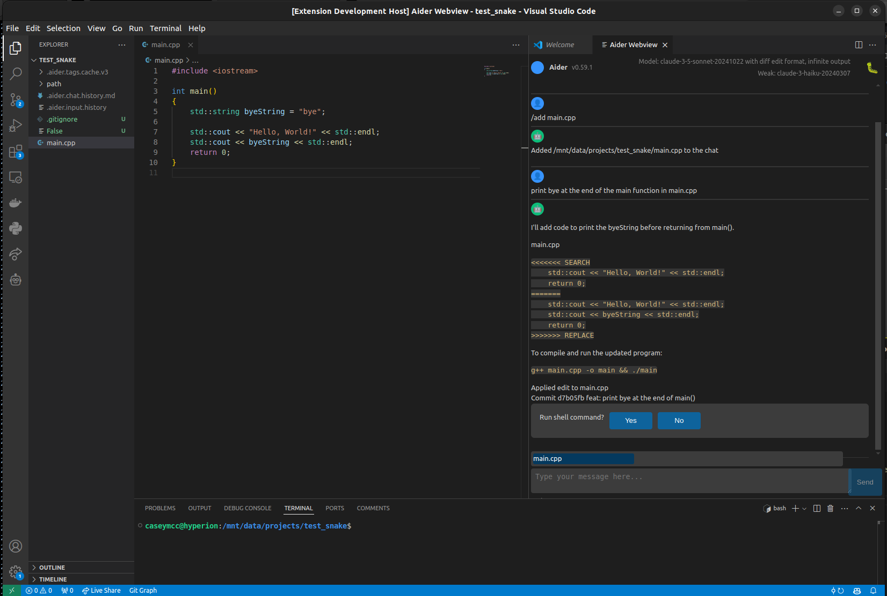

# aider-code

This is a VSCode extension for the [aider AI pair programmer](https://github.com/Aider-AI/aider). 

## Features

 - [X] VSCode chat box
   - [x] auto complete (from aider)
   - [x] prompt message boxes
 - [ ] Add icon in `Explorer` for loaded files
 - [ ] Add context menu in `Problems` to have aider fix the issue

## Requirements

You will need to setup aider manually as the extension currently requires a mod to the aider source in order to work, you will need to fetch the version from [here](https://github.com/caseymcc/aider/tree/command_io), hopefully we can get the mods in the aider repo in the future.

## Extension Settings

None at the moment

## Known Issues

## For more information

* [aider github](https://github.com/Aider-AI/aider)

